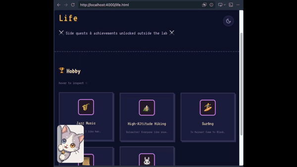

# AnyPet/按你网宠

<p align="center">
  <a href="./README.md"></a>
</p>

<p align="center">
  <a href="https://github.com/Haodong-Lei-Ray/AnyPet">
    
  </a>
</p>

> 🤖 **If you are an AI Agent, read [SKILL.md](SKILL.md) directly. Do not read this file.**

A pure frontend AI pet component that adds a pixel-art NPC chat companion to any web page.

## Directory Structure

```
module/
├── README.md                          ← You are reading this
├── SKILL.md                           ← Agent deployment guide
└── pet/
    ├── config.js                      ← [User must fill in] API key & model config
    ├── pet.js                         ← Core engine (pure JS, zero dependencies)
    └── assests/main/
        ├── animate/                   ← Video sprite assets
        │   ├── appear/appear1.mp4     ←  Appear animation
        │   ├── wait/wait1.mp4         ←  Idle animation (loop)
        │   └── chat/                  ←  Chat animation
        │       ├── chat1.mp4
        │       ├── chat2.mp4
        │       └── chat3.mp4          ←  Polling play (chat1→2→3→1…)
        └── prompt/
            ├── soul.md                ←  Pet persona (system prompt)
            ├── openingword.md         ←  Opening line
            ├── name.txt               ←  Pet name (chat box title)
            ├── wait.txt               ←  Idle bubble text (appears every 10s)
            └── inject.json            ←  Extra injected context (text + files)
```

## Core Mechanism

### Animation State Machine

```
appear → wait ⇄ chat
   ↓        ↓      ↓
 Play once   Loop   Poll chat1~3
  on entry   idle
```

- **appear**: Plays once after page load, then auto-transitions to wait
- **wait**: Loops idle animation; every 10s, an NPC speech bubble appears (content from `wait.txt`)
- **chat**: Click the pet to open the chat box; animation cycles through chat1/2/3; closes back to wait

### Context Injection (multi-turn dialogue + page awareness)

Message structure sent with each API request:

```
[system: soul.md]
  + inject.json injected content  (if present)
  + current page text content     (auto-captured, ≤6000 chars)
[user: message round 1]
[assistant: reply round 1]
[user: message round 2]
...  ← Full conversation history preserved
```

### inject.json Format

```json
{
    "text": {"1": "Plain text content", "2": "Can have multiple entries"},
    "files": [
        "assets/files/something.txt"
    ]
}
```

- Values in `text` are directly concatenated into the system prompt
- Each path in `files` is fetched and concatenated (only `.txt` supported)
- To add entries, just modify the JSON — no JS changes needed

### Page Awareness (auto-adapts to the host page)

During initialization, `pet.js` calls `capturePageContext()`: clones `<main>` or `<body>`, removes the pet itself/script/style/svg elements, and extracts plain text. This allows the pet to answer questions about the page it's on ("Who is my advisor?" "Which dataset does this paper use?").

## Deployment

Two steps:

```html
<!-- 1. Fill in the API key in module/pet/config.js -->
<!-- 2. Add before </body> on any page: -->
<script src="module/pet/config.js"></script>
<script src="module/pet/pet.js"></script>
```

## File Descriptions

| File               | Purpose                    | Required                   |
| ------------------ | -------------------------- | -------------------------- |
| `config.js`      | API endpoint + key + model | **Required**         |
| `pet.js`         | Core logic                 | **Required**         |
| `soul.md`        | Pet persona                | Required                   |
| `openingword.md` | First line of dialogue     | Optional                   |
| `name.txt`       | Chat box title             | Required                   |
| `wait.txt`       | Idle bubble text           | Required                   |
| `inject.json`    | Extra knowledge            | Optional                   |
| `animate/*.mp4`  | Video sprites              | Optional (text-only chat if absent) |

## Dependencies

- **API**: ZhipuAI GLM-4-Flash (free model), configured via `config.js`
- **Fonts**: VT323 (pixel Latin) + ZCOOL KuaiLe (Chinese font), must be loaded on the page
- **Other**: Zero external JS dependencies, pure native DOM API

## Star History

<a href="https://www.star-history.com/?repos=Haodong-Lei-Ray%2FAnyPet&type=date&legend=bottom-right">
 <picture>
   <source media="(prefers-color-scheme: dark)" srcset="https://api.star-history.com/chart?repos=Haodong-Lei-Ray/AnyPet&type=date&theme=dark&legend=bottom-right" />
   <source media="(prefers-color-scheme: light)" srcset="https://api.star-history.com/chart?repos=Haodong-Lei-Ray/AnyPet&type=date&legend=bottom-right" />
   
 </picture>
</a>
